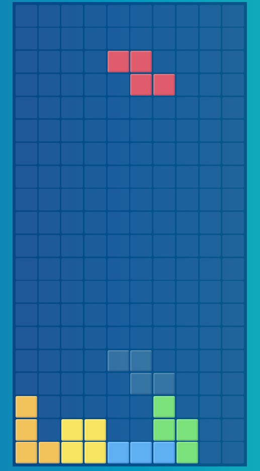

### 🎮 **Tetris Game**

A dynamic and engaging Tetris game built with **HTML**, **CSS**, and **JavaScript (ES6 modules)**. It showcases modular programming, efficient DOM manipulation, and responsive user interaction.

---

### ✨ **Features**
- **Classic Gameplay**: Rotate, move, and drop tetrominoes, clear rows, and avoid stacking to the top.
- **Ghost Piece**: See where your piece will land for strategic planning.
- **Controls**:
  - **Keyboard**: Arrow keys for movement and rotation, Space for instant drop.
  - **Touch**: Swipe gestures for movement and rotation using Hammer.js.
- **Game Over Animation**: Smooth visual effects followed by a custom sad emoji grid.
- **Live Server Ready**: Seamlessly launch and play locally.

---

### 🌟 **How to Use**
1. Clone the repository:  
   `git clone https://github.com/your-username/tetris-game.git`
2. Launch with a live server (e.g., VS Code Live Server).
3. Play using keyboard or touch controls and enjoy!

---

### 📂 **Highlights**
- **Responsive Design**: Works perfectly across devices.
- **Optimized Performance**: Smooth animations and real-time updates.
- **Modular Codebase**: Easy to maintain and extend for future enhancements.
